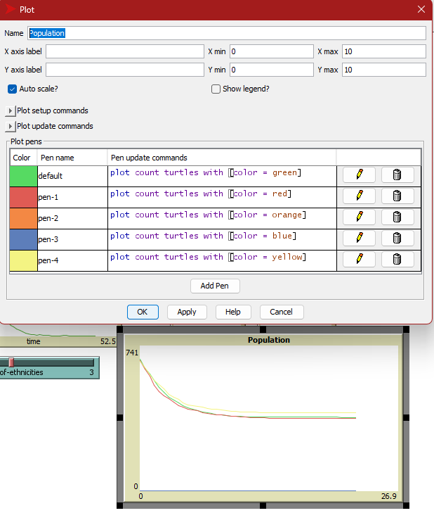
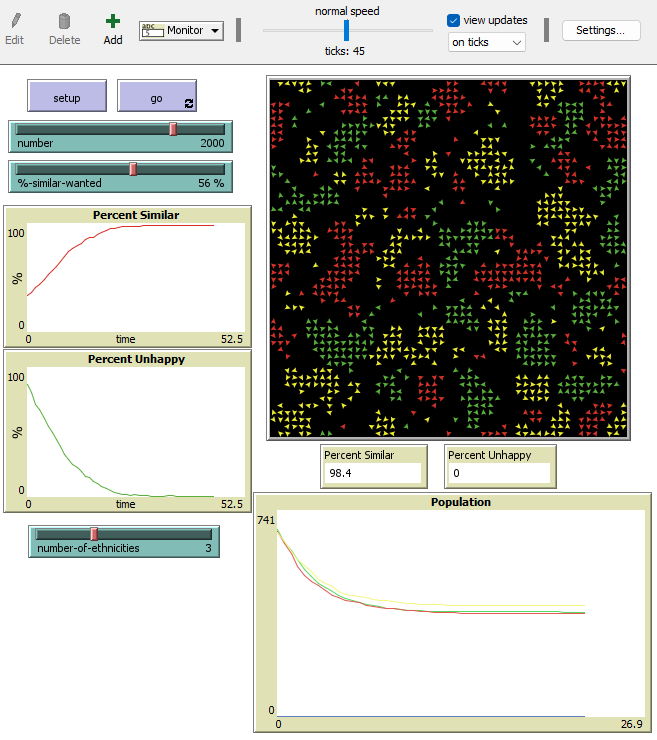
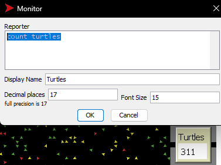
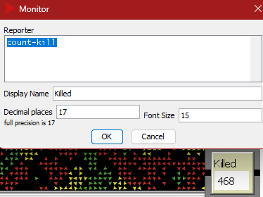
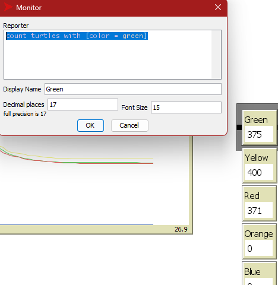
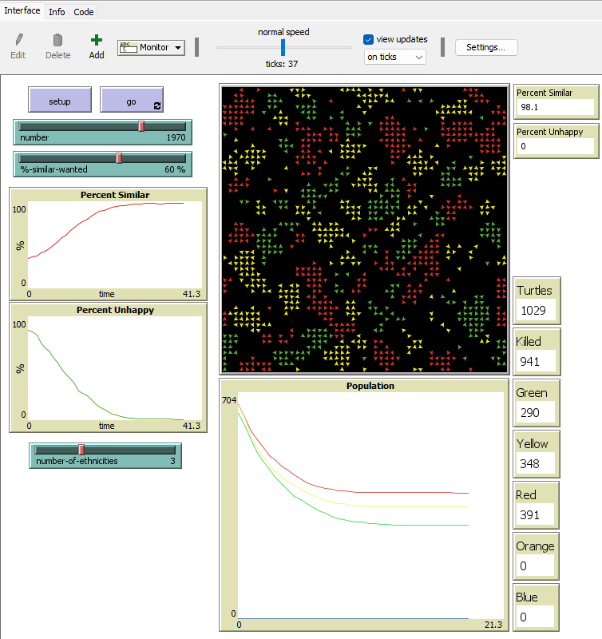
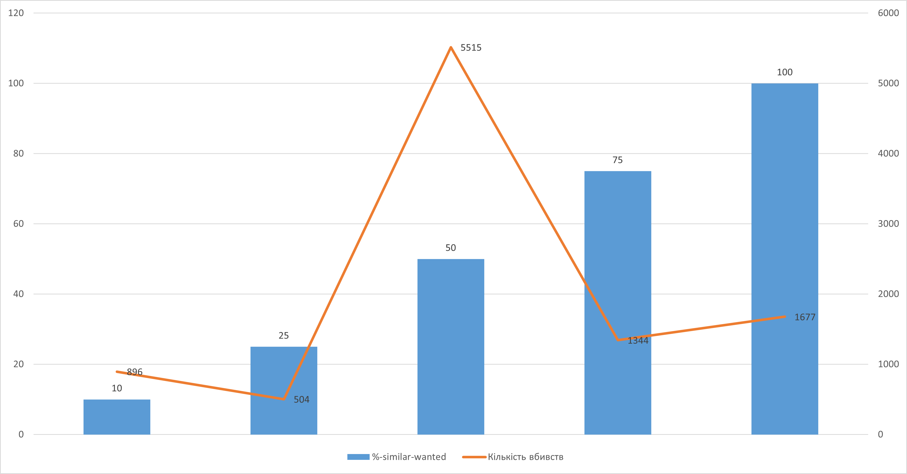

## Комп'ютерні системи імітаційного моделювання
## СПм-23-3, **Козін Микита Дмитрович**
### Лабораторна робота №2. Модифікація моделей у NetLogo

### Варіант 8: модель у середовищі NetLogo
[Segregation Simple Extension 1](http://www.netlogoweb.org/launch#http://www.netlogoweb.org/assets/modelslib/IABM%20Textbook/chapter%203/Segregation%20Extensions/Segregation%20Simple%20Extension%201.nlogo). Додано можливість зникнення агента залежно від кількості "чужих" та їх частки в оточенні. Результати відображаються графічно.

### Зміни у вихідній моделі за варіантом:
- Додано змінну *turtles-own* для підрахунку "ворогів поблизу":
<pre>
  enemy-nearby   ;; кількість чужих серед сусідніх черепах
</pre>

- Оновлено процедуру **update-turtles** для розрахунку кількості ворогів:
<pre>
  set enemy-nearby (total-nearby - similar-nearby)
</pre>

- Додано розрахунок відсоткового співвідношення союзників та ворогів:
<pre>
set ally-percent (ifelse-value total-nearby != 0 [((similar-nearby / total-nearby) * 100)] [0])
set enemy-percent (ifelse-value total-nearby != 0 [((enemy-nearby / total-nearby) * 100)] [0])
</pre>

- Введено змінну *surrounded?*, яка визначає, чи агент оточений ворогами:
<pre>
set surrounded? ally-percent < enemy-percent
</pre>

- Реалізовано логіку видалення оточених агентів у процедурі **kill-surrounded**:
<pre>
to kill-surrounded
  ask turtles with [ surrounded? ] [
    if random 10 = 1 [ die ]  ;; 10% шанс зникнення черепахи
  ]
end
</pre>

Додано графік зміни розміру популяції:

Скріншот моделі в процесі симуляції:

 

### Внесені зміни у вихідну логіку моделі, на власний розсуд:
Додано лічильник черепах:

Додано підрахунок вбивств:

<pre>
set count-kill number - count turtles
</pre>

А також лічильники кожного кольору:

Скріншот моделі в процесі симуляції:

 

## Обчислювальні експерименти
### 1. Вплив бажаної кількості схожих агентів на кількість зникнень
Проаналізовано залежність **Killed** від **%-similar-wanted**. Параметри:
- **number-of-ethnicities** = 5
- **number** = 2000

<table>
<thead>
<tr><th>%-similar-wanted</th><th>Кількість вбивств</th></tr>
</thead>
<tbody>
<tr><td>10</td><td>896</td></tr>
<tr><td>25</td><td>504</td></tr>
<tr><td>50</td><td>515</td></tr>
<tr><td>75</td><td>1344</td></tr>
<tr><td>100</td><td>1677</td></tr>
</tbody>
</table>

Результати вказують на те, що надто низькі або високі значення параметра призводять до зростання втрат серед агентів.
